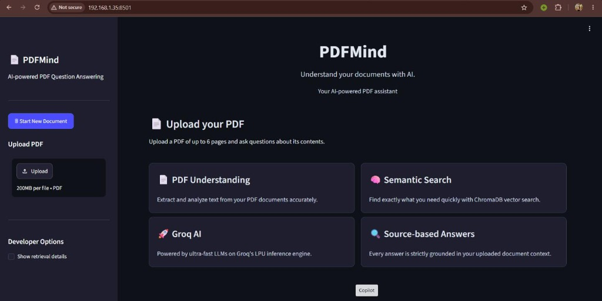
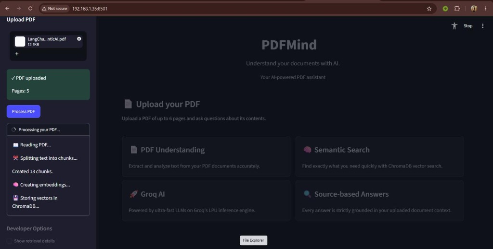
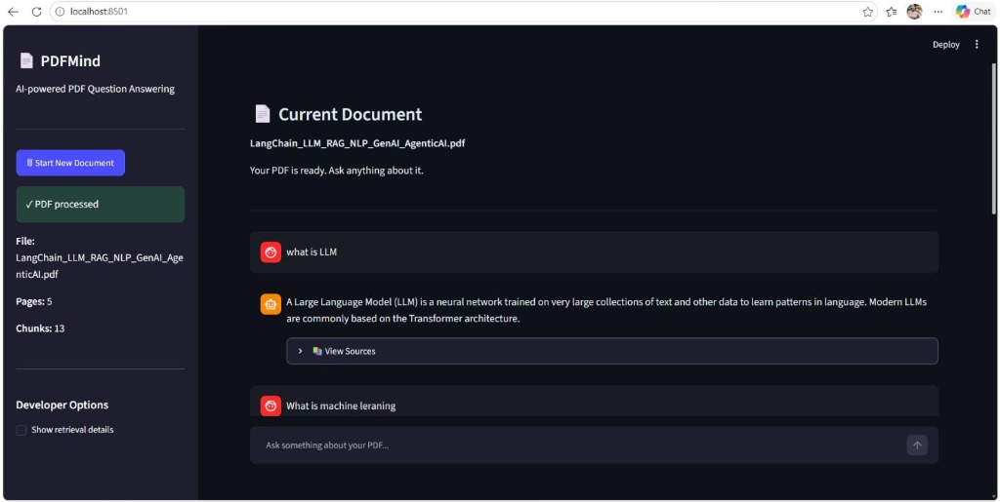

# PDFMind — AI-Powered PDF Question Answering Assistant

## 1. What PDFMind is
PDFMind is a Streamlit-based application that allows users to upload a PDF (up to 6 pages) and ask questions about its contents. It uses LangChain, Groq API, HuggingFace embeddings, and ChromaDB to provide source-grounded answers to your questions.

## 2. Screenshots
### Home & PDF Upload


### Processing PDF & Vector Embeddings


### AI Question Answering & Grounded Sources


## 3. Features
- Upload PDF files directly in the browser
- Automatic text extraction and chunking
- Grounded answers strictly based on the uploaded document
- Source tracking (showing exact page and text chunk)
- Clean, dark-mode Streamlit UI

## 4. Tech stack
- **Frontend/Backend:** Streamlit
- **LLM Orchestration:** LangChain
- **LLM Inference Engine:** Groq API (e.g. LLaMA 3)
- **Embeddings:** HuggingFace (`all-MiniLM-L6-v2`)
- **Vector Database:** ChromaDB
- **PDF Processing:** PyPDF

## 5. RAG Architecture
                 STREAMLIT
                     │
                     ▼
                PDF UPLOAD
                     │
                     ▼
              TEXT EXTRACTION
                     │
                     ▼
                  CHUNKING
                     │
                     ▼
           HUGGINGFACE EMBEDDINGS
                     │
                     ▼
                 CHROMADB
                     │
                     │
                     ▼
              USER QUESTION
                     │
                     ▼
              MMR RETRIEVER
                     │
                     ▼
             RELEVANT CHUNKS
                     │
                     ▼
                  CONTEXT
                     │
                     ▼
                 GROQ API LLM
                     │
                     ▼
              FINAL ANSWER
                     │
                     ▼
               STREAMLIT UI

## 6. Installation
1. Clone the repository
2. Install the requirements:
   ```bash
   pip install -r requirements.txt
   ```

## 7. Environment setup
1. Copy `.env.example` to `.env`
2. Add your Groq API key to `.env`:
   ```env
   GROQ_API_KEY=your_groq_api_key_here
   GROQ_MODEL=llama-3.1-8b-instant
   ```

## 8. How to run
Run the application using Streamlit:
```bash
streamlit run app.py
```

## 9. How the RAG pipeline works
When a user asks a question, the application uses Maximal Marginal Relevance (MMR) retrieval to search ChromaDB for the most relevant chunks from the PDF. These chunks form the context. The context and the question are sent to the Groq LLM with a strict prompt to only answer using the provided context, guaranteeing a grounded response.

## 10. Project structure
```text
PDFMind/
├── app.py
├── requirements.txt
├── .env
├── .env.example
├── .gitignore
├── README.md
├── assets/
│   ├── home_upload.jpg
│   ├── processing.jpg
│   └── chat_qa.jpg
└── chroma_db/
```

## 11. Example questions
- "What is the main topic of this document?"
- "Can you summarize page 2?"
- "What does the author say about machine learning?"

## 12. Troubleshooting
- **No readable text:** Ensure your PDF is a text-based document, not scanned images.
- **Missing API key:** Double-check that your `.env` file contains a valid `GROQ_API_KEY`.
- **Pages limit:** The app is configured to accept a maximum of 6 pages for demonstration purposes.
